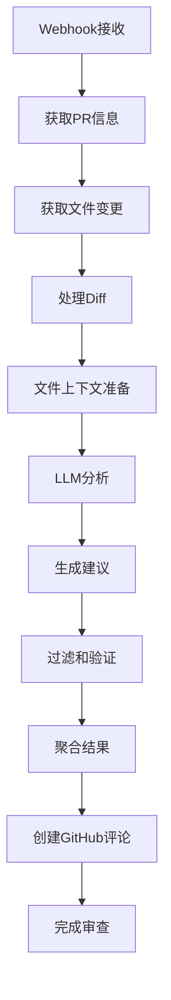

# Kodus AI 代码审查逻辑深度解析

本文档详细解释Kodus AI如何分析代码差异（diff）并生成审查建议。

## 目录

- [一、核心架构概览](#一核心架构概览)
- [二、代码审查流程](#二代码审查流程)
- [三、Diff处理机制](#三diff处理机制)
- [四、Prompt构建逻辑](#四prompt构建逻辑)
- [五、如何构造本地Diff测试](#五如何构造本地diff测试)
- [六、完整的审查逻辑](#六完整的审查逻辑)
- [七、测试指南](#七测试指南)

---

## 一、核心架构概览

### 1.1 Pipeline 架构

Kodus 使用 **多阶段Pipeline**来处理代码审查：



### 1.2 主要阶段

| 阶段               | 文件                            | 功能                | 输入           |
| ------------------ | ------------------------------- | ------------------- | -------------- |
| FetchChangedFiles  | `fetch-changed-files.stage.ts`  | 获取变更文件列表    | PR信息         |
| FileContext        | 文件上下文准备                  | 处理patch，添加行号 | FileChange对象 |
| ProcessFilesReview | `process-files-review.stage.ts` | LLM分析，生成建议   | 上下文 + patch |
| SuggestionService  | 建议过滤、去重                  | LLM输出             |
| CommentManager     | 创建GitHub评论                  | 建议结果            |

### 1.3 数据流

```
GitHub Webhook
    ↓
获取PR的diff（patch格式）
    ↓
转换为带行号的diff
    ↓
准备文件上下文
    ↓
调用LLM分析
    ↓
生成JSON格式建议
    ↓
过滤和验证
    ↓
发布到GitHub
```

---

## 二、代码审查流程

### 2.1 完整流程

```typescript
// 1. Webhook触发
POST /github/webhook
{
  "action": "opened",  // 或 "synchronize"
  "pull_request": {
    "number": 123,
    "head": "feature-branch",
    "base": "main",
    "diff_url": "https://github.com/repo/pull/123.diff"
  }
}

// 2. 获取变更文件
const files = await pullRequestService.getChangedFiles(
  organizationAndTeamData,
  repository,
  pullRequest,
  ignorePaths,  // 忽略某些路径
  lastAnalyzedCommit  // 增量处理
);

// 返回结果示例
{
  "filename": "src/service/user.ts",
  "status": "modified",  // 或 "added", "deleted"
  "patch": "@@ -27,7 +27,7 @@\n..."  // Git diff格式
  "blob_url": "https://github.com/repo/blob/new-hash/file.ts"
}

// 3. 批量分析
const batches = createOptimizedBatches(files);

for (const batch of batches) {
  const analysis = await runBatches(batch, context);

  // 分析结果
  const suggestions = analysis.validSuggestions;
  const discarded = analysis.discardedSuggestions;
}

// 4. 创建评论
await createFileComments(suggestions, context);
```

### 2.2 增量处理机制

```typescript
// 只分析自上次审查后的新提交
const lastAnalyzedCommit = context.lastExecution?.lastAnalyzedCommit;

const files = await getChangedFiles(
    repository,
    pullRequest,
    ignorePaths,
    lastAnalyzedCommit, // 关键参数
);
```

---

## 三、Diff处理机制

### 3.1 Diff 格式转换

Kodus 使用标准Git diff格式，并将其转换为带行号的格式：

#### 输入格式（标准Git diff）

```diff
diff --git a/main/src/user.ts b/feature-branch/src/user.ts
index 1234567..8910abc 100644
--- a/main/src/user.ts
+++ b/feature-branch/src/user.ts
@@ -27,7 +27,7 @@
 import { User } from './user.interface';
+import { Logger } from '@kodus/flow';

 export class UserService {
     constructor(private logger: Logger) {
+        this.logger.log('Service initialized');
     }
 }
```

#### 转换后的格式

```diff
## file: 'src/service/user.ts'

__new_block__

__old_block__

@@ -27,7 +27,7 @@

27 import { User } from './user.interface';
28- import { Logger } from '@kodus/flow';

36 export class UserService {
37     constructor(private logger: Logger) {
38 +        this.logger.log('Service initialized');
39     }
40 }
```

### 3.2 核心工具函数

#### 3.2.1 `handlePatchDeletions` - 移除删除的hunk

```typescript
// libs/common/utils/patch.ts

function handlePatchDeletions(
    patch: string,
    fileName: string,
    editType: string,
): string | null {
    // 如果文件被删除或添加，不处理
    if (!patch && editType !== 'modified' && editType !== 'added') {
        return null;
    }

    const patchLines = patch.split('\n');
    const patchNew = omitDeletionHunks(patchLines);

    if (patch !== patchNew) {
        return patchNew; // 只保留包含添加的hunk
    }
    return patch;
}

function omitDeletionHunks(patchLines: string[]): string {
    const RE_HUNK_HEADER =
        /^@@ -(\d+)(?:,(\d+))? \+(\d+)(?:,(\d+))? @@[ ]?(.*)/;
    const addedPatched: string[] = [];
    let addHunk = false;
    let insideHunk = false;

    for (const line of patchLines) {
        if (line.startsWith('@@')) {
            // 找到新的hunk，保存之前的内容
            if (insideHunk && addHunk) {
                addedPatched.push(...tempHunk);
            }
            addHunk = false;
            insideHunk = true;
        } else if (line.startsWith('+')) {
            addHunk = true;
        }

        tempHunk.push(line);
    }

    // 如果当前hunk有添加内容，保留它
    if (insideHunk && addHunk) {
        addedPatched.push(...tempHunk);
    }

    return addedPatched.join('\n');
}
```

#### 3.2.2 `convertToHunksWithLineNumbers` - 转换为带行号

```typescript
function convertToHunksWithLineNumbers(
    patch: string,
    file: { filename?: string },
): string {
    let patchWithLinesStr = `\n\n## file: '${file.filename.trim()}'\n`;
    const patchLines = patch.split('\n');
    const RE_HUNK_HEADER =
        /^@@ -(\d+)(?:,(\d+))? \+(\d+)(?:,(\d+))? @@[ ]?(.*)/;

    let newContentLines: string[] = [];
    let oldContentLines: string[] = [];

    for (const line of patchLines) {
        if (line.startsWith('@@')) {
            // 解析hunk头部：@@ -old_start,old_len +new_start,new_len
            const match = line.match(RE_HUNK_HEADER);
            const [start1, size1, start2, size2] = match
                .slice(1)
                .map((v) => parseInt(v, 10));

            // 添加标记
            if (newContentLines.length > 0 || oldContentLines.length > 0) {
                patchWithLinesStr += `\n__new hunk__\n`;
            }
        } else if (line.startsWith('+')) {
            newContentLines.push(line);
        } else if (line.startsWith('-')) {
            oldContentLines.push(line);
        }
    }

    return patchWithLinesStr.trim();
}
```

#### 3.2.3 `extractLinesFromDiffHunk` - 提取修改范围

```typescript
interface ModifiedRange {
    start: number;
    end: number;
}

function extractLinesFromDiffHunk(diffHunk: string): ModifiedRange[] {
    const lines = diffHunk.split('\n');
    const modifiedRanges: ModifiedRange[] = [];
    let currentRange: ModifiedRange | null = null;

    for (const line of lines) {
        // 解析hunk头部
        if (line?.startsWith('@@')) {
            const match = line?.match(/@@ -\d+(?:,\d+)? \+(\d+)(?:,(\d+))? @@/);
            const [start1, size1, start2, size2] = match
                .slice(1)
                .map((v) => parseInt(v, 10));

            // 如果有未关闭的范围，关闭它
            if (currentRange) {
                modifiedRanges.push(currentRange);
                currentRange = null;
            }
        }

        // 处理修改行
        const lineMatch = line?.match(/^(\d+) ([+-])/);
        if (lineMatch) {
            const lineNumber = parseInt(lineMatch[1], 10);
            const changeType = lineMatch[2]; // '+' 或 '-'

            // 只处理添加的行（+）
            if (changeType === '+') {
                if (!currentRange) {
                    currentRange = { start: lineNumber, end: lineNumber };
                } else if (lineNumber === currentRange.end + 1) {
                    // 连续行，扩展范围
                    currentRange.end = lineNumber;
                } else {
                    // 不连续，关闭当前范围，开始新范围
                    modifiedRanges.push(currentRange);
                    currentRange = { start: lineNumber, end: lineNumber };
                }
            }
        }
    }

    // 关闭最后一个范围
    if (currentRange) {
        modifiedRanges.push(currentRange);
    }

    return modifiedRanges;
}
```

### 3.3 Diff 处理流程图

```
Git Diff (patch)
    ↓
1. handlePatchDeletions
   - 移除只包含删除的hunk
   ↓
2. convertToHunksWithLineNumbers
   - 解析 @@ -27,7 +27,7
   - 识别 __old_block__ 和 __new_block__
   - 给代码行添加行号
   ↓
3. extractLinesFromDiffHunk
   - 提取连续的修改行范围
   - 返回 ModifiedRange[]: [{start: 27, end: 40}]
   ↓
用于构建提示词的上下文
```

---

## 四、Prompt构建逻辑

### 4.1 Prompt 层次结构

```typescript
// libs/common/utils/langchainCommon/prompts/configuration/codeReview.ts

interface CodeReviewPromptPayload {
    limitationType: 'file' | 'suggestions';
    maxSuggestionsParams: number;
    languageResultPrompt: string;  // 'en-US', 'zh-CN'
    fileContent: string;
    patchWithLinesStr: string;  // 带行号的diff
    relevantContent: string | null;  // 提取的相关代码片段
    prSummary: string;
    v2PromptOverrides: {
        categories: {
            bug?: string;
            performance?: string;
            security?: string;
        };
        severity: {
            critical?: string;
            high?: string;
            medium?: string;
            low?: string;
        };
    };
    externalPromptContext: {
        customInstructions?: {
            references?: any[];
            error?: string;
        };
    };
    contextAugmentations: {
        [path: string]: {
            requirementId?: string;
            outputs?: Array<{...}>;
        };
    };
    contextPack?: ContextPack;  // MCP工具输出
}
```

### 4.2 系统提示词（System Prompt）

```typescript
// 提示词文件路径
const prompt_codereview_system_main = () => {
    return `
You are Kody PR-Reviewer, a senior engineer specialized in understanding and reviewing code,
with deep knowledge of how LLMs function.

Your mission:

Provide detailed, constructive, and actionable feedback on code by analyzing it in depth.

Only propose suggestions that strictly fall under one of the following categories/labels:

- 'security': 潜在漏洞、安全问题
- 'error_handling': 错误处理改进
- 'refactoring': 重构建议（可读性、可维护性）
- 'performance_and_optimization': 性能和优化
- 'maintainability': 可维护性改进
- 'potential_issues': 潜在bug或逻辑错误
- 'code_style': 代码风格和标准一致性

Focus on maintaining correctness, domain relevance, and realistic applicability.
Avoid trivial, nonsensical, or redundant recommendations.
Each suggestion should be logically sound, well-justified, and enhance code.
`;
};
```

### 4.3 用户提示词（User Prompt）

```typescript
// 提示词文件路径
const prompt_codereview_user_main = (payload: CodeReviewPayload) => {
    return `
<generalGuidelines>
**通用指导原则**:
- 理解PR的目的
- **仅关注带 '+' 的行**（新增代码）
- 不要建议删除或修改带 '-' 的行
- 在给出建议前确保技术正确性和合理性
- 每个建议只使用一个类别标签
- 保持建议简洁清晰
- 使用文件中的完整上下文，不要做假设

**重要**：
- 参见完整文件内容，使用 <file></file> 标签
- 如果要引用特定行，使用相对于hunk的行号
- 不要建议会破坏代码或引入回归的变更
</generalGuidelines>

<thoughtProcess>
**逐步思考**:
1. **分类识别**：
   - Security: 是否有不安全的数据处理或操作？
   - Maintainability: 代码是否清晰、模块化？
   - Performance: 是否有性能瓶颈或不必要的复杂性？

2. **验证建议**：
   - 建议是否真的解决了问题？
   - 是否引入了新问题？
   - 是否有更简单的实现方式？

3. **内部一致性**：
   - 建议之间是否相互矛盾？
   - 是否遵循了代码的现有模式？
</thoughtProcess>

<codeForAnalysis>
**待审查的代码差异（PR Diff）**：

${payload.patchWithLinesStr}

${
    payload.relevantContent
        ? `**相关代码片段**:\n\`\`\`
${payload.relevantContent}
`
        : ''
}

</codeForAnalysis>

<suggestionFormat>
**建议格式**:

仅返回JSON对象：

\`\`\`json
{
    "codeSuggestions": [
        {
            "relevantFile": "文件路径",
            "language": "编程语言",
            "suggestionContent": "详细建议内容",
            "existingCode": "当前代码",
            "improvedCode": "改进后的代码",
            "oneSentenceSummary": "一句话总结",
            "relevantLinesStart": "起始行号",
            "relevantLinesEnd": "结束行号",
            "label": "security|error_handling|refactoring|...",
            "llmPrompt": "用于LLM的提示词"
        }
    ]
}
\`\`\`

<finalSteps>
1. **语言**: 使用 ${languageNote}
2. **仅返回JSON**，不要有其他文本
3. 确保JSON格式正确
</finalSteps>
`;
};
```

### 4.4 Prompt 生成流程

```
Payload 构建
    ↓
基础提示词
    ↓
注入 Override（自定义规则）
    ↓
注入外部上下文
    ↓
注入MCP工具输出
    ↓
注入Patch（带行号）
    ↓
构建完整System Prompt
    ↓
构建完整User Prompt
    ↓
发送给LLM
    ↓
返回JSON格式的建议
```

---

## 五、如何构造本地Diff测试

### 5.1 方法一：模拟GitHub Webhook

#### 5.1.1 创建测试分支和PR

```bash
# 1. 克隆你的测试仓库
git clone https://github.com/YOUR_USERNAME/test-kodus-review.git
cd test-kodus-review

# 2. 创建测试分支
git checkout -b main
git checkout -b feature/test-review

# 3. 创建一个包含"问题"的文件
cat > src/problematic-code.ts << 'EOF'
export class UserService {
    constructor() {
        console.log('Service initialized');
    }

    authenticate() {
        return 'token-12345';
    }
}
EOF

# 4. 提交"有问题的"代码
git add .
git commit -m "feat: add user service with hardcoded credentials"

# 5. 推送到GitHub
git push origin feature/test-review

# 6. 在GitHub上创建PR
# - Base: main
# - Compare: feature/test-review
# - 这会触发Kodus Webhook
```

#### 5.1.2 配置Webhook端点

```bash
# 在本地启动ngrok或使用Kodus的tunnel
yarn tunnel

# 这会创建一个公开URL，例如：
# https://abc123.ngrok.io/github/webhook

# 更新GitHub App的webhook URL到这个地址
```

### 5.2 方法二：直接调用Dry Run API（推荐）

#### 5.2.1 创建Dry Run

```bash
# 通过API创建Dry Run
curl -X POST http://localhost:3001/dryRun \
  -H "Content-Type: application/json" \
  -H "Authorization: Bearer YOUR_JWT_TOKEN" \
  -d '{
    "organizationId": "YOUR_ORG_ID",
    "teamId": "YOUR_TEAM_ID",
    "repositoryId": "YOUR_REPO_ID",
    "pullRequestNumber": 123,
    "baseBranch": "main",
    "headBranch": "feature/test-review",
    "commitId": "YOUR_COMMIT_SHA"
  }'
```

响应示例：

```json
{
    "uuid": "dry-run-uuid-123",
    "status": "completed",
    "dryRunType": "pullRequest",
    "result": {
        "validSuggestions": [
            {
                "suggestionContent": "在 authenticate() 方法中硬编码了令牌，存在安全风险。",
                "existingCode": "return 'token-12345';",
                "improvedCode": "return this.getToken();",
                "oneSentenceSummary": "移除硬编码的认证令牌",
                "label": "security"
            }
        ]
    }
}
```

### 5.3 方法三：手动构造Patch测试（高级）

#### 5.3.1 构造Git Diff

```bash
# 方法1: 使用git diff生成
git diff main feature/test-review > test-diff.patch

# 方法2: 手动创建patch文件
cat > manual-test.patch << 'EOF'
diff --git a/main/src/code.ts b/feature/src/code.ts
index abc123..def456 100644
--- a/main/src/code.ts
+++ b/feature/src/code.ts
@@ -1,3 +1,4 @@
 export function process() {
-    console.log("Processing...");
+    console.log("Starting process...");
+    console.log("Done!");
 }
EOF
```

#### 5.3.2 验证Patch处理

```typescript
// 创建测试脚本
const patch = require('fs').readFileSync('test-diff.patch', 'utf8');
const { convertToHunksWithLineNumbers } = require('./libs/common/utils/patch');

// 转换为带行号格式
const patchWithLines = convertToHunksWithLineNumbers(patch, {
    filename: 'src/code.ts',
});

console.log('Original Patch:');
console.log(patch);
console.log('\n\nConverted Patch with Line Numbers:');
console.log(patchWithLines);
```

#### 5.3.3 使用API测试Prompt

```bash
# 准备测试Payload
PAYLOAD='{
  "languageResultPrompt": "en-US",
  "fileContent": "export function process() {\n    console.log(\"Processing...\");\n}",
  "patchWithLinesStr": "## file: '"'"'src/code.ts'"'"\n\n__new_block__\n\n__old_block__\n\n@@ -1,3 +1,4 @@\n\n1 export function process() {\n-    console.log(\"Processing...\");\n+    console.log(\"Starting process...\");\n+    console.log(\"Done!\");\n}",
  "limitationType": "file",
  "maxSuggestionsParams": 5
}'

# 调用Dry Run API
curl -X POST http://localhost:3001/dryRun/analyze \
  -H "Content-Type: application/json" \
  -H "Authorization: Bearer YOUR_JWT_TOKEN" \
  -d "$PAYLOAD"
```

### 5.4 方法四：使用.kodus-config.yml配置（推荐用于仓库级别）

#### 5.4.1 在仓库根目录创建配置文件

```yaml
# .kodus-config.yml
review:
  enabled: true
  language: typescript
  rules:
    - name: "安全最佳实践"
      severity: "critical"
      description: "确保代码遵循安全最佳实践，避免硬编码凭据、SQL注入等"

    - name: "代码风格一致性"
      severity: "medium"
      description: "使用PascalCase命名类，camelCase命名函数和变量"

    - name: "错误处理"
      severity: "high"
      description: "所有错误都应该被捕获和记录，不应该被静默忽略"

  files:
    - src/**/*.ts
    lib/**/*.ts

  ignorePaths:
    - node_modules/**
    - dist/**
    - *.test.ts

  suggestionControl:
    maxSuggestions: 10
    groupingMode: "by_file"
```

#### 5.4.2 推送测试PR

```bash
# 当创建或更新PR时，Kodus会自动：
1. 读取仓库根目录的.kodus-config.yml
2. 应用配置的规则
3. 生成符合规则的建议
4. 在PR中添加评论

# 测试步骤：
git checkout -b feature/test
git push origin feature/test
# 在GitHub上创建或更新PR
```

### 5.5 验证结果

```bash
# 1. 查看GitHub PR上的评论
# 你应该看到Kodus添加的代码审查评论

# 2. 使用API查看详细结果
curl http://localhost:3001/codeReview/suggestions?prNumber=123 \
  -H "Authorization: Bearer YOUR_TOKEN"

# 3. 查看Dry Run历史
curl http://localhost:3001/dryRun/history?repositoryId=YOUR_REPO_ID \
  -H "Authorization: Bearer YOUR_TOKEN"

# 4. 查看日志
yarn docker:logs | grep -i "kody\|review\|suggestion"
```

---

## 六、完整的审查逻辑

### 6.1 文件上下文准备流程

```typescript
// libs/code-review/infrastructure/adapters/services/code-analysis/file/base-file-review.abstract.ts

async prepareFileContext(
    file: FileChange,
    context: AnalysisContext,
): Promise<{ fileContext: AnalysisContext } | null> {
    if (!file?.patch) {
        return null;
    }

    // 1. 处理patch，移除只包含删除的hunk
    const patchFormatted = handlePatchDeletions(
        file.patch,
        file.filename,
        file.status
    );

    if (!patchFormatted) {
        return null;
    }

    // 2. 转换为带行号的格式
    const patchWithLinesStr = convertToHunksWithLineNumbers(
        patchFormatted,
        file
    );

    // 3. 确定审查模式（Light/Heavy）
    const reviewMode = await determineReviewMode({
        fileChangeContext: { file },
        patch: patchWithLinesStr,
        context
    });

    // 4. 提取相关代码片段
    const relevantContent = await getRelevantFileContent(
        file,
        context
    );

    return {
        ...context,
        fileChangeContext: {
            file,
            relevantContent,
            patchWithLinesStr,
            hasRelevantContent: !!relevantContent
        },
        reviewModeResponse: reviewMode
    };
}
```

### 6.2 LLM分析流程

```typescript
// libs/code-review/infrastructure/adapters/services/llmAnalysis.service.ts

async analyzeCodeWithAI_v2(
    context: AnalysisContext,
    parameters?: AnalysisParameters
): Promise<AnalysisResult> {
    const {
        fileContext,
        patchWithLinesStr,
        reviewModeResponse,
        codeReviewConfig,
        byokConfig
    } = context;

    // 1. 构建Prompt payload
    const payload = {
        limitationType: codeReviewConfig?.suggestionControl?.limitationType,
        maxSuggestionsParams: codeReviewConfig?.suggestionControl?.maxSuggestions || 10,
        languageResultPrompt: context.languageResultPrompt || 'en-US',
        fileContent: fileContext?.file?.content,
        patchWithLinesStr,
        relevantContent: fileContext?.relevantContent,
        prSummary: context.prSummary,
        v2PromptOverrides: codeReviewConfig?.v2PromptOverrides,
        externalPromptContext: context.externalPromptContext,
        contextAugmentations: context.contextAugmentations,
        contextPack: context.contextPack
    };

    // 2. 调用LLM
    const { result } = await observabilityService.runLLMInSpan({
        runName: 'code-analysis',
        input: [userPrompt],
        config: {
            llmProvider: parameters.llmProvider,
            fallbackProvider: parameters.fallbackProvider,
            byokConfig,
            temperature: 0,
            maxTokens: 8000
        },
        callbacks: [...callbacks],
        responseFormat: { type: 'json_schema' }
    });

    // 3. 解析LLM返回
    const suggestions = this.processLLMResponse(result);

    // 4. 验证建议
    const validatedSuggestions = await suggestionService.validateSuggestions(
        suggestions,
        context.patchWithLinesStr
    );

    return {
        validSuggestions: validatedSuggestions,
        discardedSuggestions: []
    };
}
```

### 6.3 建议过滤和验证

```typescript
// libs/code-review/infrastructure/adapters/services/suggestion.service.ts

async validateSuggestions(
    suggestions: CodeSuggestion[],
    patchWithLinesStr: string
): Promise<CodeSuggestion[]> {
    // 1. 提取diff中的修改范围
    const modifiedRanges = extractLinesFromDiffHunk(patchWithLinesStr);

    // 2. 验证每个建议
    return suggestions.filter(suggestion => {
        // 2.1 建议引用了被修改的行
        const referencesModifiedLines = modifiedRanges.some(range =>
            suggestion.relevantLinesStart >= range.start &&
            suggestion.relevantLinesEnd <= range.end
        );

        // 2.2 建议使用了正确的类别标签
        const hasValidLabel = ['security', 'error_handling', 'refactoring',
            'performance_and_optimization', 'maintainability',
            'potential_issues', 'code_style', 'documentation_and_comments']
            .includes(suggestion.label);

        // 2.3 建议有合理的代码
        const { existingCode, improvedCode } = suggestion;
        const codeHasChanges = existingCode !== improvedCode;

        return referencesModifiedLines && hasValidLabel && codeHasChanges;
    });
}
```

### 6.4 评论创建

```typescript
// libs/code-review/infrastructure/adapters/services/commentManager.service.ts

async createFileComments(
    suggestions: CodeSuggestion[],
    context: CodeReviewContext
): Promise<void> {
    for (const suggestion of suggestions) {
        const commentBody = `
## ${suggestion.label.toUpperCase()}

${suggestion.oneSentenceSummary}

### 当前代码
\`\`\`typescript
${suggestion.existingCode}
\`\`\`

### 建议改进
\`\`\`typescript
${suggestion.improvedCode}
\`\`\`

<details>
  <summary>查看详细</summary>

  [${suggestion.suggestionContent}]

  <br/>

  **文件**: ${suggestion.relevantFile}
  <br/>
  **行号**: ${suggestion.relevantLinesStart}-${suggestion.relevantLinesEnd}
  <br/>
  **LLM提示词**: [${suggestion.llmPrompt}](llm-prompt)
</details>

<!-- kody-codereview-${suggestion.uuid} -->
<!-- kody-codereview -->
`;

        // 创建GitHub评论
        await octokit.rest.issues.createComment({
            owner: context.repository.owner,
            repo: context.repository.name,
            issue_number: context.pullRequest.number,
            body: commentBody
        });
    }
}
```

---

## 五、如何构造本地Diff测试

### 5.1 方法一：模拟GitHub Webhook

### 7.1 端到端测试流程

```bash
# 1. 健康检查
curl http://localhost:3001/health

# 2. 测试Dry Run（创建一个简单的测试）
# 见5.2节

# 3. 查看生成的建议
curl http://localhost:3001/dryRun/YOUR_DRY_RUN_UUID

# 4. 验证建议格式
# 建议应该包含：
# - relevantFile: 文件路径
# - suggestionContent: 详细描述
# - existingCode: 当前代码
# - improvedCode: 改进后代码
# - oneSentenceSummary: 一句话总结
# - relevantLinesStart/End: 行号范围
# - label: 分类标签
```

### 7.2 本地仓库测试流程

```bash
# 1. 在你的测试仓库中创建.kodus-config.yml
cat > .kodus-config.yml << 'EOF'
review:
  enabled: true
  rules:
    - name: "安全检查"
      severity: "critical"
      description: "不使用硬编码的API密钥或令牌"
  files:
    - src/**/*.ts
EOF

# 2. 创建有"问题"的文件
cat > src/with-issue.ts << 'EOF'
// 硬编码的API密钥 - 安全问题
const API_KEY = 'sk-1234567890';

export function getApiKey() {
    return API_KEY;
}
EOF

# 3. 提交并推送到GitHub
git add .
git commit -m "feat: add hardcoded API key"
git push origin main

# 4. 在GitHub上创建PR
# Base: main → Compare: feature/test-review
# Kodus会自动审查并检测到安全问题
```

### 7.3 调试和监控

```bash
# 查看实时日志
yarn docker:logs -f kodus_api

# 查看Worker日志
yarn docker:logs -f kodus_worker

# 查看特定文件的处理日志
docker logs kodus_api 2>&1 | grep -i "src/service/user.ts"

# 启用详细日志（在.env中设置）
API_LOG_LEVEL=debug
API_LOG_PRETTY=true
```

### 7.4 常见问题和解决方案

#### 问题1：没有看到审查评论

**可能原因**：

- Webhook未正确配置
- PR已存在且被标记为"已审查"
- Kody Rules未启用

**解决方案**：

```bash
# 1. 检查webhook配置
curl http://localhost:3001/webhook-health

# 2. 检查Kody Rules状态
curl http://localhost:3001/organization/parameters/code-review \
  -H "Authorization: Bearer YOUR_TOKEN" | jq '.configValue.rules'

# 3. 检查PR状态
curl http://localhost:3001/pullRequests/123 \
  -H "Authorization: Bearer YOUR_TOKEN"
```

#### 问题2：审查结果不符合预期

**可能原因**：

- BYOK配置不正确
- LLM模型不适合代码审查
- Prompt overrides不生效

#### 通过API创建Kody Rules

```bash
# 创建安全规则
curl -X POST http://localhost:3001/kodyRules \
  -H "Content-Type: application/json" \
  -H "Authorization: Bearer $ACCESS_TOKEN" \
  -d '{
    "title": "禁止硬编码凭据",
    "description": "代码中不应包含硬编码的API密钥、令牌、密码",
    "language": "typescript",
    "rule": {
      "title": "安全检查",
      "content": "扫描代码中是否包含硬编码的敏感信息。",
      "severity": "critical",
      "category": "security"
    }
  }'

echo "✅ 安全规则已创建"
```

#### 问题3：性能问题（审查太慢）

**可能原因**：

- 文件数量过多
- Token限制过小
- LLM响应慢

**解决方案**：

```bash
# 减少建议数量
curl -X PATCH http://localhost:3001/organization/parameters/code-review \
  -H "Content-Type: application/json" \
  -H "Authorization: Bearer $ACCESS_TOKEN" \
  -d '{
    "configValue": {
      "suggestionControl": {
        "maxSuggestions": 5
      }
    }
  }'

echo "✅ 已配置为最多5条建议"
```

**解决方案**：

```bash
# 1. 检查LLM配置
curl http://localhost:3001/organization/parameters/code-review \
  -H "Authorization: Bearer YOUR_TOKEN" | jq '.configValue.byokConfig'

# 2. 更新BYOK配置
curl -X PATCH http://localhost:3001/organization/parameters/code-review \
  -H "Content-Type: application/json" \
  -H "Authorization: Bearer YOUR_TOKEN" \
  -d '{
    "configValue": {
      "byokConfig": {
        "main": {
          "provider": "openai_compatible",
          "apiKey": "your-api-key",
          "model": "deepseek-chat",
          "baseURL": "https://api.deepseek.com"
        }
      }
    }
  }'
```

#### 问题3：性能问题（审查太慢）

**可能原因**：

- 文件数量过多
- Token限制过小
- LLM响应慢

**解决方案**：

```bash
# 1. 调整批量大小
curl -X PATCH http://localhost:3001/organization/parameters/code-review \
  -H "Content-Type: application/json" \
  -H "Authorization: Bearer YOUR_TOKEN" \
  -d '{
    "configValue": {
      "reviewOptions": {
        "batchSize": 5
      }
    }
  }'

# 2. 减少建议数量
curl -X PATCH http://localhost:3001/organization/parameters/code-review \
  -H "Content-Type: application/json" \
  -H "Authorization: Bearer YOUR_TOKEN" \
  -d '{
    "configValue": {
      "suggestionControl": {
        "maxSuggestions": 5
      }
    }
  }'
```

### 7.5 高级：自定义审查规则

#### 通过API创建Kody Rules

#### 通过API创建Kody Rules

```bash
# 创建安全规则
curl -X POST http://localhost:3001/kodyRules \
  -H "Content-Type: application/json" \
  -H "Authorization: Bearer YOUR_TOKEN" \
  -d '{
    "title": "不使用硬编码凭据",
    "description": "检测API密钥、令牌、密码等硬编码在代码中的凭据",
    "language": "typescript",
    "rule": {
      "title": "安全检查",
      "content": "扫描代码中是否包含硬编码的API密钥、令牌、密码或其他敏感信息。",
      "severity": "critical",
      "category": "security"
    }
  }'

# 创建代码风格规则
curl -X POST http://localhost:3001/kodyRules \
  -H "Content-Type: application/json" \
  -H "Authorization: Bearer YOUR_TOKEN" \
  -d '{
    "title": "使用PascalCase",
    "description": "类名使用PascalCase，函数和变量使用camelCase",
    "language": "typescript",
    "rule": {
      "title": "命名规范",
      "content": "检查代码是否遵循TypeScript命名规范。",
      "severity": "medium",
      "category": "code_style"
    }
  }'
```

---

## 总结

### 核心要点

1. **Diff处理**：
    - Git diff → 带行号patch → 提取修改范围
    - 只关注新增代码（+行）
    - 忽略删除的hunk

2. **Prompt构建**：
    - 基础System Prompt（角色定义）
    - 注入Override（自定义规则）
    - 注入External Context（外部文件）
    - 注入Patch（带行号）
    - 要求JSON格式输出

3. **审查流程**：
    - Webhook → 获取文件 → 准备上下文 → LLM分析
    - 过滤验证 → 创建评论 → 发布到GitHub

4. **测试方式**：
    - 最简单：Dry Run API
    - 推荐：.kodus-config.yml + PR
    - 高级：构造patch手动测试

### 关键文件位置

| 功能         | 文件路径                                                                      |
| ------------ | ----------------------------------------------------------------------------- |
| Diff处理     | `libs/common/utils/patch.ts`                                                  |
| Prompt构建   | `libs/common/utils/langchainCommon/prompts/configuration/codeReview.ts`       |
| LLM分析      | `libs/code-review/infrastructure/adapters/services/llmAnalysis.service.ts`    |
| 建议验证     | `libs/code-review/infrastructure/adapters/services/suggestion.service.ts`     |
| 评论创建     | `libs/code-review/infrastructure/adapters/services/commentManager.service.ts` |
| Dry Run      | `libs/code-review/application/use-cases/dryRun/...`                           |
| Pipeline编排 | `libs/code-review/pipeline/stages/...`                                        |

### API端点参考

| 端点                                        | 功能                        |
| ------------------------------------------- | --------------------------- |
| `POST /dryRun`                              | 创建Dry Run（推荐测试方式） |
| `POST /dryRun/analyze`                      | 分析文件                    |
| `POST /kodyRules`                           | 创建自定义规则              |
| `POST /organization/parameters/code-review` | 配置BYOK和规则              |
| `GET /codeReview/suggestions`               | 查看建议历史                |
| `GET /pullRequests/:id`                     | 查看PR状态                  |
### 快速开始

```bash
# 1. 注册用户
curl -X POST http://localhost:3001/auth/signup \
  -H "Content-Type: application/json" \
  -d '{"name":"MyUser","email":"myuser@test.dev","password":"MyPass123!"}'

# 2. 登录获取Token，保存到环境变量
ACCESS_TOKEN=$(curl -s -X POST http://localhost:3001/auth/login \
  -H "Content-Type: application/json" \
  -d '{"email":"myuser@test.dev","password":"MyPass123!"}' \
  | python3 -c "import sys, json; data=json.load(sys.stdin); print(json.load(sys.stdin)['accessToken'])")

export ACCESS_TOKEN="$ACCESS_TOKEN"

echo "✅ 已登录并获取Token"
```
